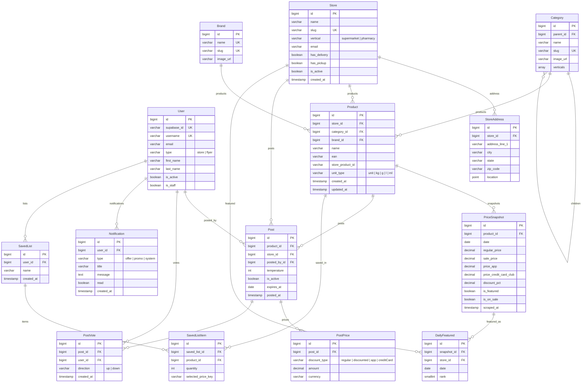

# ER Diagram — tabloid-web

```mermaid
erDiagram

    %% ── accounts ──────────────────────────────────────────
    User {
        bigint id PK
        varchar supabase_id UK
        varchar username UK
        varchar email
        varchar type "store | flyer"
        varchar first_name
        varchar last_name
        boolean is_active
        boolean is_staff
    }

    %% ── stores ────────────────────────────────────────────
    Store {
        bigint id PK
        varchar name
        varchar slug UK
        varchar vertical "supermarket | pharmacy"
        varchar email
        boolean has_delivery
        boolean has_pickup
        boolean is_active
        timestamp created_at
    }

    StoreAddress {
        bigint id PK
        bigint store_id FK
        varchar address_line_1
        varchar city
        varchar state
        varchar zip_code
        point location
    }

    %% ── catalog ───────────────────────────────────────────
    Category {
        bigint id PK
        bigint parent_id FK
        varchar name
        varchar slug UK
        varchar image_url
        array verticals
    }

    Brand {
        bigint id PK
        varchar name UK
        varchar slug UK
        varchar image_url
    }

    Product {
        bigint id PK
        bigint store_id FK
        bigint category_id FK
        bigint brand_id FK
        varchar name
        varchar ean
        varchar store_product_id
        varchar unit_type "unit | kg | g | l | ml"
        timestamp created_at
        timestamp updated_at
    }

    PriceSnapshot {
        bigint id PK
        bigint product_id FK
        date date
        decimal regular_price
        decimal sale_price
        decimal price_app
        decimal price_credit_card_club
        decimal discount_pct
        boolean is_featured
        boolean is_on_sale
        timestamp scraped_at
    }

    DailyFeatured {
        bigint id PK
        bigint snapshot_id FK
        bigint store_id FK
        date date
        smallint rank
    }

    %% ── deals ─────────────────────────────────────────────
    Post {
        bigint id PK
        bigint product_id FK
        bigint store_id FK
        bigint posted_by_id FK
        int temperature
        boolean is_active
        date expires_at
        timestamp posted_at
    }

    PostPrice {
        bigint id PK
        bigint post_id FK
        varchar discount_type "regular | discounted | app | creditCard"
        decimal amount
        varchar currency
    }

    PostVote {
        bigint id PK
        bigint post_id FK
        bigint user_id FK
        varchar direction "up | down"
        timestamp created_at
    }

    Notification {
        bigint id PK
        bigint user_id FK
        varchar type "offer | promo | system"
        varchar title
        text message
        boolean read
        timestamp created_at
    }

    SavedList {
        bigint id PK
        bigint user_id FK
        varchar name
        timestamp created_at
    }

    SavedListItem {
        bigint id PK
        bigint saved_list_id FK
        bigint product_id FK
        int quantity
        varchar selected_price_key
    }

    %% ── relationships ─────────────────────────────────────
    Store         ||--o{ StoreAddress   : "address"
    Store         ||--o{ Product        : "products"
    Store         ||--o{ Post           : "posts"
    Store         ||--o{ DailyFeatured  : "featured"

    Category      ||--o{ Category       : "children"
    Category      ||--o{ Product        : "products"

    Brand         ||--o{ Product        : "products"

    Product       ||--o{ PriceSnapshot  : "snapshots"
    Product       ||--o{ Post           : "posts"
    Product       ||--o{ SavedListItem  : "saved_in"

    PriceSnapshot ||--o{ DailyFeatured  : "featured_as"

    User          ||--o{ Post           : "posted_by"
    User          ||--o{ PostVote       : "votes"
    User          ||--o{ Notification   : "notifications"
    User          ||--o{ SavedList      : "lists"

    Post          ||--o{ PostPrice      : "prices"
    Post          ||--o{ PostVote       : "votes"

    SavedList     ||--o{ SavedListItem  : "items"
```
